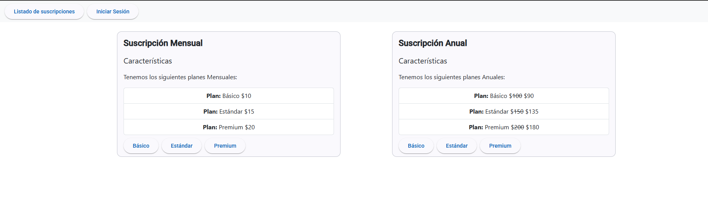
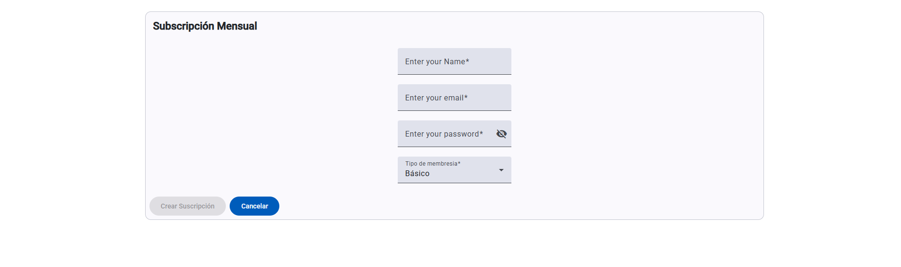
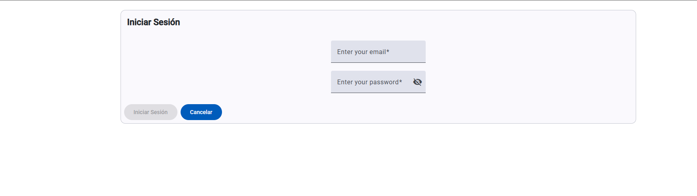
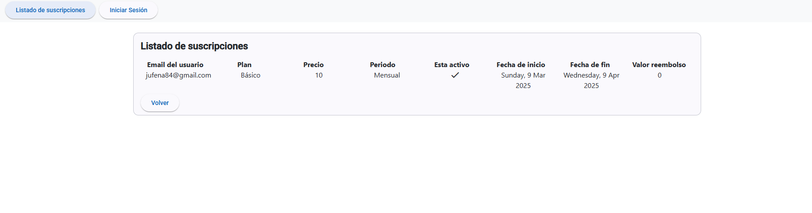
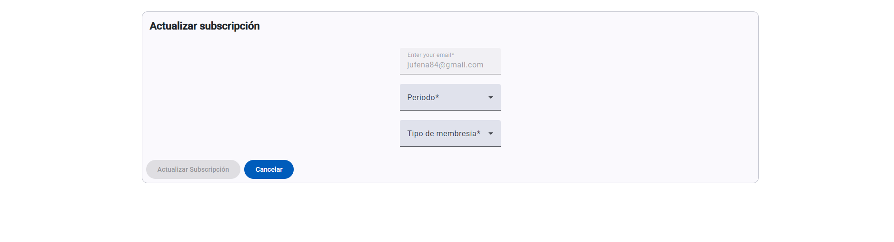
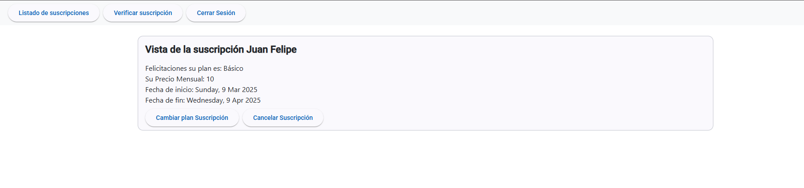
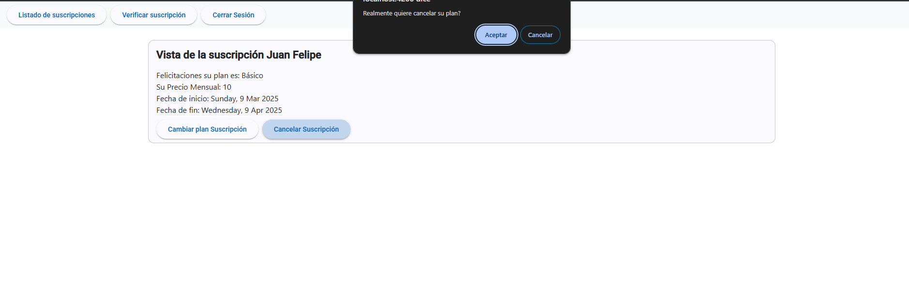

# StreamingSubscription

## Development server

Se debe tener **node 20**
Para levantarlo en local se debe ejecutar:

```bash
npm install
npm start
```

Navegar a `http://localhost:4200/`. 

## Recursos adicionales

Fue usada la versión 19 de Angular en la cuál no se usan modulos sino componentes standalone para facilidades.

Se utilizó arquitectura hexagonal con DDD, en la cual encontramos las siguientes capas:

**Application**: Se encuentra la implementación de los casos de uso cuyas abstracciones fueron definidas en el dominio. Los casos de uso suelen usar el patrón facade donde se abstrae la implementación y cada caso de uso es creado con el concepto de servicio de angular para usar el injectable y poder ser injectados en las vistas; estos servicios son singleton.

**Domain**: Se encuentran las entidades de dominio, los objetos de valor y las abstracciones de los casos de uso y del repositorio. En el dominio encontramos la lógica de negocio de la suscripción. Este dominio esta limpio de angular, ninguna anotación implementación o algo que tenga que ver con el framework. Las abstracciones de caso de uso se segregaron en interfaces donde se verifica que ningún caso de uso tiene que ver con el otro (cancelar, actualizar, suscribir, etc)

**Infrastructure**: Implementa las abstracciones de los repositorios del dominio, en este caso para simular un store de bbdd en memoria, pero se podría implementar cualquier otro tipo de bbdd

**Views**: Son los componentes de angular para interactuar con el navegador.

Se ha diseñado un inicio de sesión para darle un toque mas realista

### Reglas de negocio
**Descuento para plan anual**
Se hace el calculo del 10% cuando se elige un plan anual (dentro de subscription.ts)

**Actualización de plan**
Cuando se hace un cambio de plan dependiendo la fecha se pone para el siguiente período; este objeto es nextSubscription dentro de suscription y se hace un calculo para verificar si hay o no reembolso dependiendo del plan.

**Cancelación**
Cuando se cancela un plan se hace un calculo considerando la fecha actual y la fecha final del plan, se mira el valor por día y la diferencia de días si existe se da como reembolso; esto es tanto para mensuales como para anuales.

**Notas**
No se puede crear una nueva suscripción si ya tiene una activa para el mismo usuario (email)

Como es una aplicación pequeña se usaron las nuevas señales que son poderosas y funcionan como obervables, de esa manera podemos cambiar la estrategia de cambio para evitar el onzone de angular y usar el push.

Para desacoplar la capa de application con la de infrastructure y no inyectar la dependencia de la implementación del repositorio en los casos de uso se optó por crear una carpeta config a la par de las arquitectónicas donde se creo un token inyectable que a su vez se inicia en el componente standalone principal de la aplicación y así se puede inyectar la implementación para la abstracción del repositorio del dominio.

Por el tiempo no se han implementado pruebas unitarias

### Capturas







